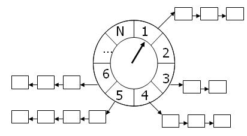

# 时间轮定时器



## linux kernel 3.1 实现

```c
#define TVN_BITS (CONFIG_BASE_SMALL ? 4 : 6)
#define TVR_BITS (CONFIG_BASE_SMALL ? 6 : 8)
#define TVN_SIZE (1 << TVN_BITS)
#define TVR_SIZE (1 << TVR_BITS)
#define TVN_MASK (TVN_SIZE - 1)
#define TVR_MASK (TVR_SIZE - 1)

struct tvec {
	struct list_head vec[TVN_SIZE];
};

struct tvec_root {
	struct list_head vec[TVR_SIZE];
};

struct tvec_base {
	spinlock_t lock;
	struct timer_list *running_timer;
	unsigned long timer_jiffies;
	unsigned long next_timer;
	struct tvec_root tv1;
	struct tvec tv2;
	struct tvec tv3;
	struct tvec tv4;
	struct tvec tv5;
} ____cacheline_aligned;

...

static void internal_add_timer(struct tvec_base *base, struct timer_list *timer)
{
	unsigned long expires = timer->expires;
	unsigned long idx = expires - base->timer_jiffies;
	struct list_head *vec;

	if (idx < TVR_SIZE) {
		int i = expires & TVR_MASK;
		vec = base->tv1.vec + i;
	} else if (idx < 1 << (TVR_BITS + TVN_BITS)) {
		int i = (expires >> TVR_BITS) & TVN_MASK;
		vec = base->tv2.vec + i;
	} else if (idx < 1 << (TVR_BITS + 2 * TVN_BITS)) {
		int i = (expires >> (TVR_BITS + TVN_BITS)) & TVN_MASK;
		vec = base->tv3.vec + i;
	} else if (idx < 1 << (TVR_BITS + 3 * TVN_BITS)) {
		int i = (expires >> (TVR_BITS + 2 * TVN_BITS)) & TVN_MASK;
		vec = base->tv4.vec + i;
	} else if ((signed long) idx < 0) {
		/*
		 * Can happen if you add a timer with expires == jiffies,
		 * or you set a timer to go off in the past
		 */
		vec = base->tv1.vec + (base->timer_jiffies & TVR_MASK);
	} else {
		int i;
		/* If the timeout is larger than 0xffffffff on 64-bit
		 * architectures then we use the maximum timeout:
		 */
		if (idx > 0xffffffffUL) {
			idx = 0xffffffffUL;
			expires = idx + base->timer_jiffies;
		}
		i = (expires >> (TVR_BITS + 3 * TVN_BITS)) & TVN_MASK;
		vec = base->tv5.vec + i;
	}
	/*
	 * Timers are FIFO:
	 */
	list_add_tail(&timer->entry, vec);
}

...

static inline void detach_timer(struct timer_list *timer,
				int clear_pending)
{
	struct list_head *entry = &timer->entry;

	debug_deactivate(timer);

	__list_del(entry->prev, entry->next);
	if (clear_pending)
		entry->next = NULL;
	entry->prev = LIST_POISON2;
}

...

static inline int
__mod_timer(struct timer_list *timer, unsigned long expires,
						bool pending_only, int pinned)
{
	struct tvec_base *base, *new_base;
	unsigned long flags;
	int ret = 0 , cpu;

	timer_stats_timer_set_start_info(timer);
	BUG_ON(!timer->function);

	base = lock_timer_base(timer, &flags);

	if (timer_pending(timer)) {
		detach_timer(timer, 0);
		if (timer->expires == base->next_timer &&
		    !tbase_get_deferrable(timer->base))
			base->next_timer = base->timer_jiffies;
		ret = 1;
	} else {
		if (pending_only)
			goto out_unlock;
	}

	debug_activate(timer, expires);

	cpu = smp_processor_id();

#if defined(CONFIG_NO_HZ) && defined(CONFIG_SMP)
	if (!pinned && get_sysctl_timer_migration() && idle_cpu(cpu))
		cpu = get_nohz_timer_target();
#endif
	new_base = per_cpu(tvec_bases, cpu);

	if (base != new_base) {
		/*
		 * We are trying to schedule the timer on the local CPU.
		 * However we can't change timer's base while it is running,
		 * otherwise del_timer_sync() can't detect that the timer's
		 * handler yet has not finished. This also guarantees that
		 * the timer is serialized wrt itself.
		 */
		if (likely(base->running_timer != timer)) {
			/* See the comment in lock_timer_base() */
			timer_set_base(timer, NULL);
			spin_unlock(&base->lock);
			base = new_base;
			spin_lock(&base->lock);
			timer_set_base(timer, base);
		}
	}

	timer->expires = expires;
	if (time_before(timer->expires, base->next_timer) &&
	    !tbase_get_deferrable(timer->base))
		base->next_timer = timer->expires;
	internal_add_timer(base, timer);

out_unlock:
	spin_unlock_irqrestore(&base->lock, flags);

	return ret;
}

...

static int cascade(struct tvec_base *base, struct tvec *tv, int index)
{
	/* cascade all the timers from tv up one level */
	struct timer_list *timer, *tmp;
	struct list_head tv_list;

	list_replace_init(tv->vec + index, &tv_list);

	/*
	 * We are removing _all_ timers from the list, so we
	 * don't have to detach them individually.
	 */
	list_for_each_entry_safe(timer, tmp, &tv_list, entry) {
		BUG_ON(tbase_get_base(timer->base) != base);
		internal_add_timer(base, timer);
	}

	return index;
}

...

static inline void __run_timers(struct tvec_base *base)
{
	struct timer_list *timer;

	spin_lock_irq(&base->lock);
	while (time_after_eq(jiffies, base->timer_jiffies)) {
		struct list_head work_list;
		struct list_head *head = &work_list;
		int index = base->timer_jiffies & TVR_MASK;

		/*
		 * Cascade timers:
		 */
		if (!index &&
			(!cascade(base, &base->tv2, INDEX(0))) &&
				(!cascade(base, &base->tv3, INDEX(1))) &&
					!cascade(base, &base->tv4, INDEX(2)))
			cascade(base, &base->tv5, INDEX(3));
		++base->timer_jiffies;
		list_replace_init(base->tv1.vec + index, &work_list);
		while (!list_empty(head)) {
			void (*fn)(unsigned long);
			unsigned long data;

			timer = list_first_entry(head, struct timer_list,entry);
			fn = timer->function;
			data = timer->data;

			timer_stats_account_timer(timer);

			base->running_timer = timer;
			detach_timer(timer, 1);

			spin_unlock_irq(&base->lock);
			call_timer_fn(timer, fn, data);
			spin_lock_irq(&base->lock);
		}
	}
	base->running_timer = NULL;
	spin_unlock_irq(&base->lock);
}
```

## profiler

## 问题

- 时间：uint/TimeSpan
- linkedlist
- 回调：lambda/固定参数
- 峰
